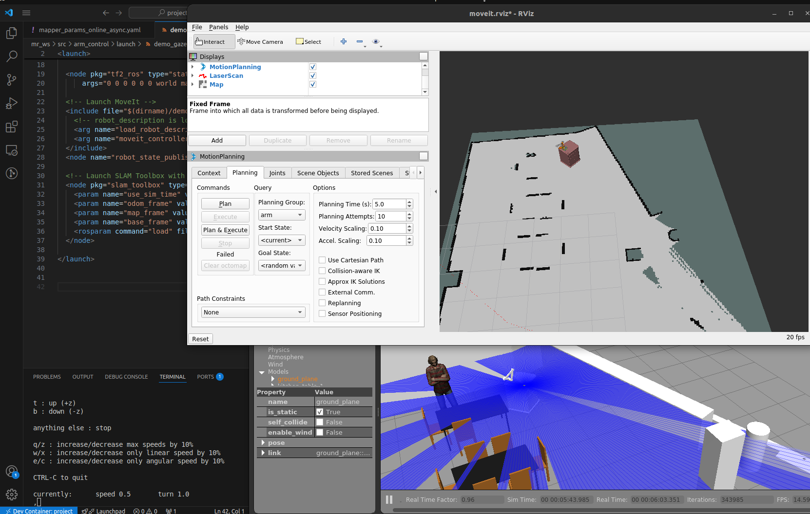

> open the folder in vscode 
> bottom left you will see the option open in container
> after the cotainer starts running open terminal

> go to mr_ws and build the package one (catkin build)
> source the workspace (source devel/setup.bash)
> enter the command (roslaunch arm_control demo_gazebo.launch)
  : you can vizualize both rviz and gazebo 

> open another terminal and source it
> then enter (rosrun teleop_twist_keyboard teleop_twist_keyboard.py )
> you can move the robot by entering the keys specified (make sure to keep this termianl on top)

